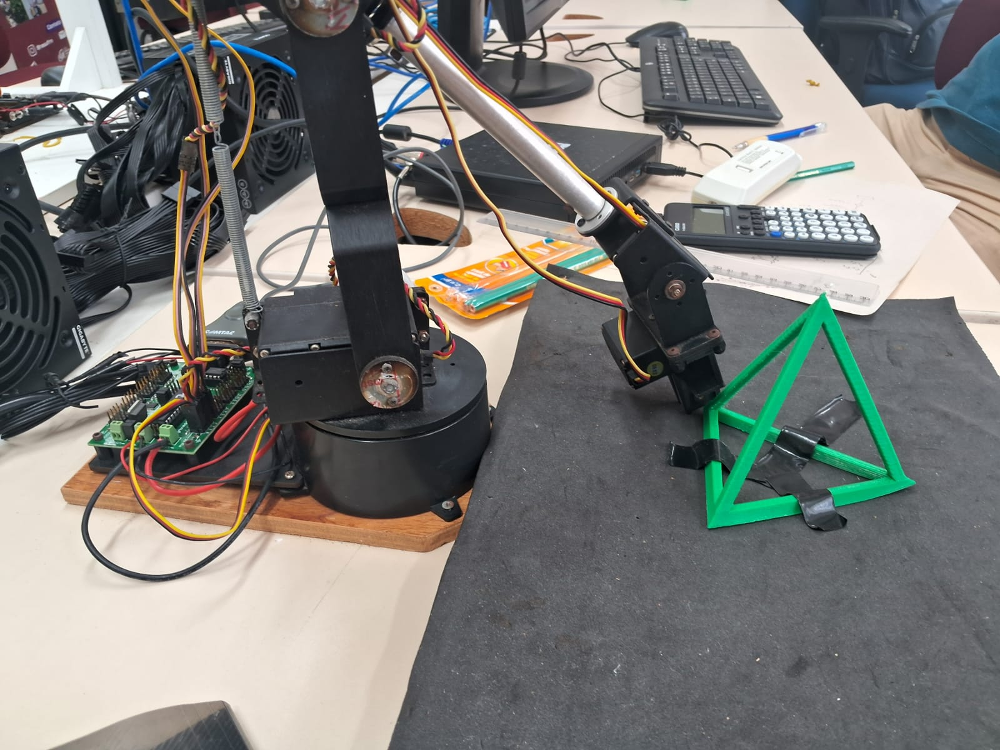
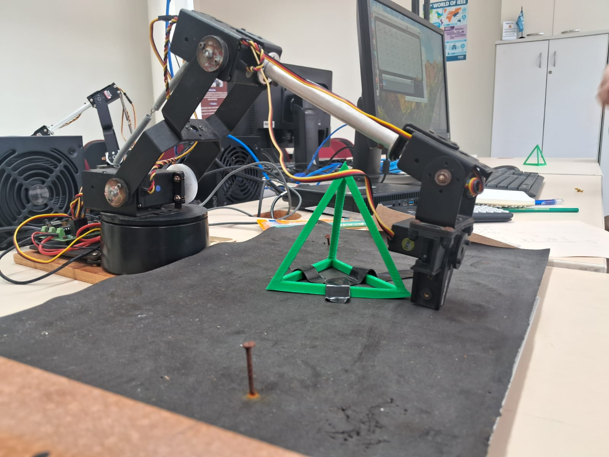
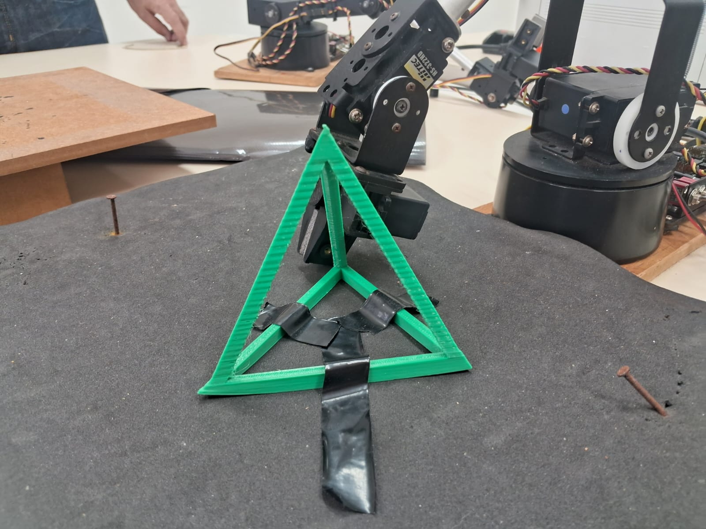
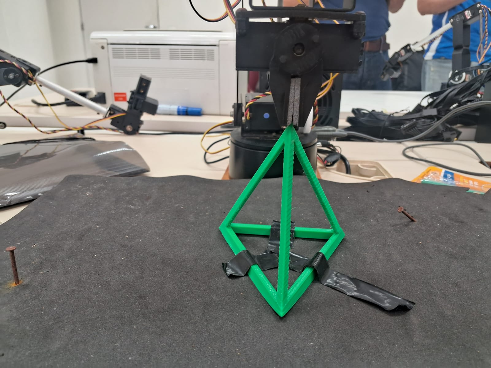
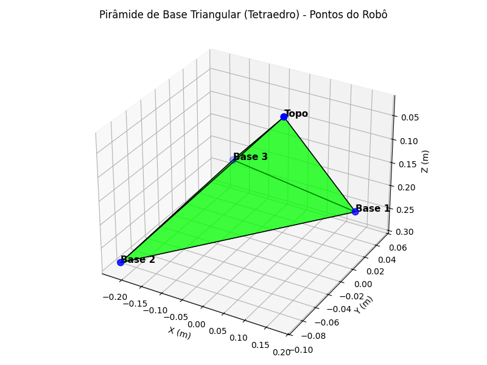

# Relatório: Cinemática Direta e Espaço de Trabalho de Braço Robótico

## Introdução

Durante a aula, realizamos um experimento prático para entender a cinemática direta de um braço robótico. O objetivo foi medir pontos do espaço de trabalho, construir as equações dos ângulos de cada elo e validar os resultados por meio de visualização gráfica.

## Metodologia

1. **Medição dos Pontos:**
   - Utilizamos o braço robótico para posicionar o atuador em diferentes pontos do espaço.
   - Registramos os valores PWM dos servos para cada posição.
   - Medimos manualmente as coordenadas dos pontos para comparação.

2. **Construção das Equações:**
   - Derivamos as equações para calcular os ângulos de cada elo a partir dos valores PWM.
   - Implementamos funções para converter PWM em ângulos e calcular as matrizes de transformação.

3. **Cinemática Direta:**
   - Aplicamos as equações para obter a posição final do atuador para cada conjunto de valores PWM.
   - Geramos uma tabela com PWM, ângulos e posições (X, Y, Z).

4. **Visualização:**
   - Plotamos os pontos medidos e calculados em um gráfico 3D.
   - Representamos o espaço de trabalho como uma pirâmide de base triangular (tetraedro).

   - Abaixo estão as imagens das coletas dos pontos do robô, organizadas em uma tabela:

### Coleta dos dados de posição do Tetraedro

| Base 1 | Base 2 | Base 3 | Topo |
|:------:|:------:|:------:|:----:|
|  |  |  |  |
| *Figura 1: Atuador posicionado no ponto Base 1.* | *Figura 2: Atuador posicionado no ponto Base 2.* | *Figura 3: Atuador posicionado no ponto Base 3.* | *Figura 4: Atuador posicionado no ponto Topo.* |

## Resultados e Discussão

Além disso, segue abaixo o gráfico gerado pelo código, mostrando o espaço de trabalho calculado:

*Figura 5: Espaço de trabalho do robô plotado a partir dos dados coletados e calculados.*

- Observamos que os pontos calculados e medidos apresentam diferenças significativas.
- As principais fontes de erro incluem:
  - **Imprecisão nas medições manuais** dos pontos e dos comprimentos dos elos.
  - **Incerteza dos servos** (histerese, folga mecânica, variação de resposta).
  - **Simplificações nas equações** (desconsiderando pequenas inclinações ou desalinhamentos).
  - **Calibração limitada** dos servos (apenas alguns pontos de referência).
- Concluímos que, apesar dos esforços, o modelo apresenta limitações e incertezas inerentes ao sistema físico e ao processo de medição.

## Conclusão

O experimento permitiu compreender na prática os desafios da cinemática direta e da modelagem de braços robóticos. A visualização do espaço de trabalho evidenciou os erros envolvidos, reforçando a importância de medições precisas, calibração adequada e consideração das incertezas do sistema.

---
*Relatório elaborado com base nas atividades práticas e nos resultados obtidos em aula.*
